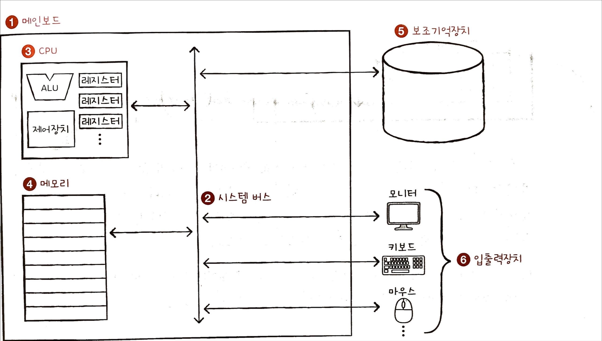

# 01-1 컴퓨터 구조를 알아야 하는 이유

### 문제해결
컴퓨터 구조는 실력 있는 개발자가 되려면 반드시 알아야 할 기본 지식힙니다.  

실무에서 문제가 종종 생깁니다. 그렇짐나 컴퓨터 구조를 이해하고 있다면 문제 상황을 빠르게 진달할 수 있고 문제 해결의 실마리를 다양하게 찾을 수 있습니다. 컴퓨터 내부를 꺼리낌 없이 들여다보면 더 좋은 해결책을 고민할 겁니다. 
컴퓨터는 '미지의 대상'이 아닌 '분석의 대상'입니다.

### 성능, 용량, 비용
성능, 용량, 비용은 컴퓨터 언어를 알고 있다고 해서 해결하기 쉽지 않습니다. 그렇지만 컴퓨터 구조를 이해하면 성능, 용량, 비용까지 고려하며 개발하는 개발자가 될 수 있습니다.

# 01-2 컴퓨터 구조의 큰 그림  
컴퓨터는 0과1로 표현된 정보만 이해합니다. 그것의 두 종류가 있는데 데이터와 명령어입니다.

## 컴퓨터가 이해하는 정보
### 데이터란?
컴퓨터가 이해할수 있는 숫자, 문자, 이미지, 동영상 같은 정적이 정보를 뜻합니다.

### 명령어란?
데이터를 움직이고 컴퓨터를 작동시키는 정보입니다.

## 컴퓨터의 네 가지 핵심 부품

컴퓨터에는 4가지 종류의 부품이 있습니다.
중앙처리장치(`CPU`), 주기억장치(`메모리`), 보조기억장치, 입출력장치 입니다.

1. 가장 큰 사각형은 메인보드입니다.
2. 메인보드 안에 시스템 버스가 있습니다.
3. CPU 내부에는 ALU, 제어장치와 여러 레지스터가 있습니다.
4. 메모리는 메인보드 내 시스템 버스와 연결되어 있습니다.
5. 보조기억장치는 메인보드 내 시스템 버스와 연결되어 있습니다.
6. 모니터, 키보드, 마우스 등은 메인보드 내 시스템 버스와 연결되어 있습니다.

### 메모리
메모리는 실행되는 프로그램의 명령어와 데이터를 저장하는 부품입니다.
메모리에 저장도니 값에 빠르고 효율적으로 접근하기 위해 주소라는 개념을 사용합니다. 
메모리는 실행되기 위해서 반드시 메모리에 되어 있어야 합니다.
메모리는 현재 실행되는 프로그램의 명령어와 데이터를 저장합니다.
메모리에 저장된 값의 위치는 주소로 알 수 있습니다.

### CPU
CPU는 컴퓨터의 두뇌입니다. 메모리에 저장된 명령어를 읽어 들이고, 읽어 들인 명령어를 해석하고, 실행하는 부품입니다.
내부 구조에는 산술논리연산장치(`ALU`), 레지스터, 제어장치가 있습니다.

ALU는 계산기 역할을 합니다. 즉 계산을 위해 존재하는 부품입니다.
레지스터는 CPU의 작은 임시 저장 장치입니다. 

### 보조기억장치
메모리보다 크기가 크고 전원이 꺼져도 저장된 내용을 잃지 않는 메모리를 보조할 저장 장치가 필요하게 되는데, 이 저장 장치를 보조기억장치라고 합니다.

하드 디스크, SSD, USB 메모리, DVD와 같은 저장 장치가 보조기억장치의 일종입니다.  
메모리가 현재 실행되는 프로그램을 저장한다면, 보조기억장치는 보관할 프로그램을 저장합니다.

### 입출력장치
입출력장치는 마이크, 스피커, 프린터, 마우스등 외부에서 연결되어 컴퓨터 내부와 정보를 교환하는 장치를 의미합니다. 보조 기억장치와 입출력장치를 컴퓨터 주변에 붙어있는 장치라고 부릅니다.

### 메인보드와 시스템 버스
컴퓨터의 핵심 부품을 모두 메인보드 판에 연결됩니다. 이는 메인보드 내부에 버스라는 통로가 있기 때문입니다.
여러 버스 가운데 컴퓨터의 네 가지 핵심 부품을 연결하는 가장 중요한 버스는 시스템 버스입니다.
